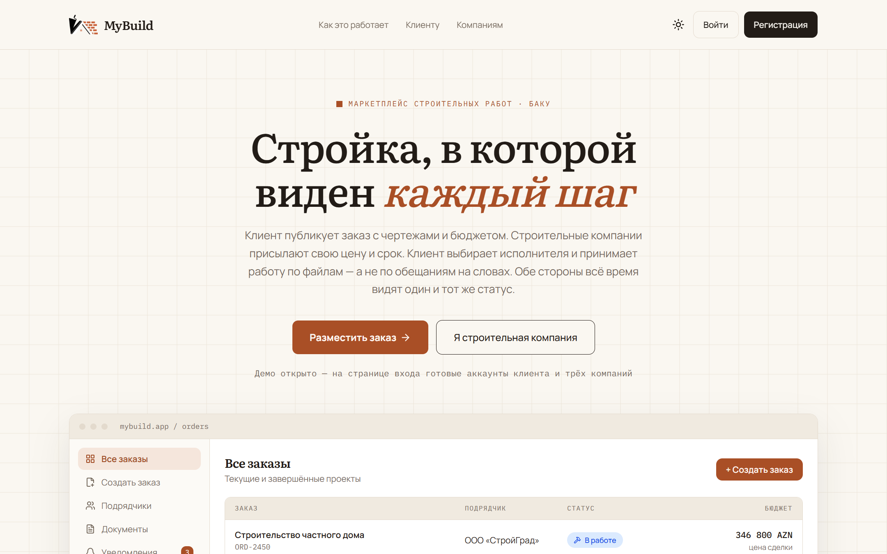
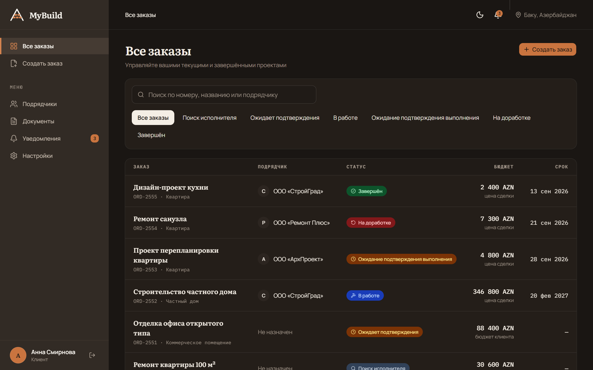
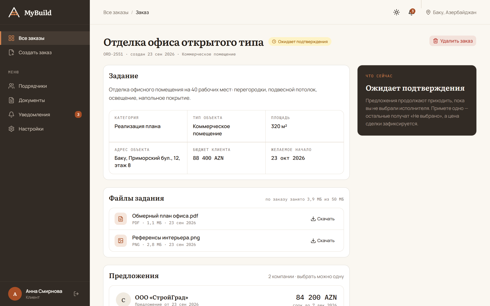
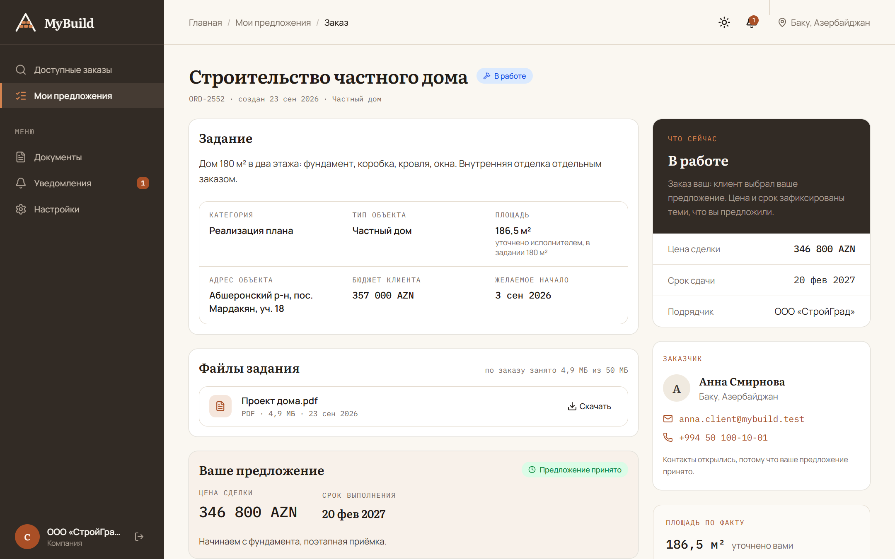
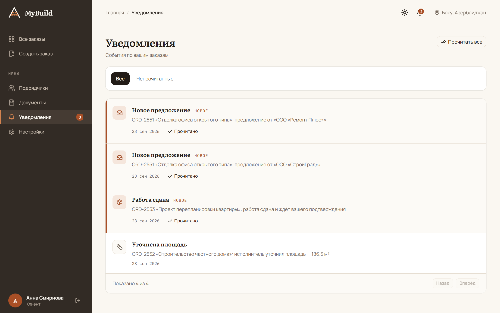
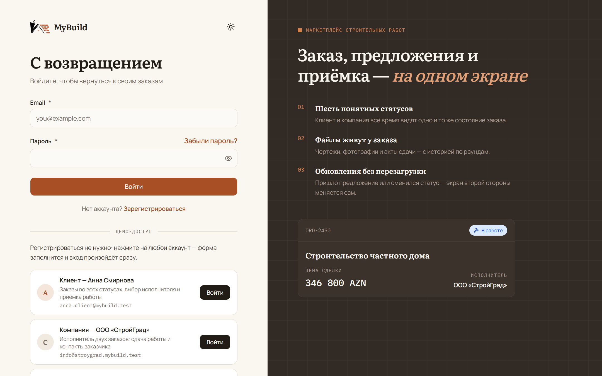

<div align="center">
  

  <h1>MyBuild</h1>

  <p><b>Двусторонний маркетплейс для строительства: клиент публикует заказ, компании предлагают цену и срок, клиент выбирает исполнителя и принимает работу.</b></p>

  <p>
    <a href="https://my-build-frontend-psi.vercel.app">Живое демо</a> ·
    <a href="#демо">Тестовые аккаунты</a> ·
    <a href="#скриншоты">Скриншоты</a> ·
    <a href="#локальный-запуск">Запуск локально</a>
  </p>

  <p>
    
    
    
    
    
    
  </p>
</div>

---

## Что это

Учебно-портфолийный, но доведённый до продакшена проект: полный цикл сделки между
заказчиком и строительной компанией, от публикации заказа до приёмки работы.

- **Клиент** создаёт заказ (категория, тип объекта, площадь, адрес, бюджет, файлы),
  получает предложения с ценой и сроком, выбирает одно, контролирует ход работ,
  принимает результат или возвращает на доработку.
- **Компания** видит ленту заказов вместе с ожиданиями клиента по бюджету, отправляет
  своё предложение, после выбора выполняет работу, прикладывает файлы с комментарием
  и сдаёт на подтверждение.

Ядро — **явная state-машина заказа**: все переходы описаны таблицей, живут в одном
месте и применяются атомарно, вместе с побочными эффектами и уведомлениями.

## Демо

| | |
|---|---|
| Интерфейс | <https://my-build-frontend-psi.vercel.app> |
| API | <https://mybuild-api.onrender.com> (`/health` — проверка живости) |

Регистрироваться не нужно: на странице входа есть блок «Демо-доступ» — кнопка
рядом с аккаунтом заполняет форму и сразу входит. Те же аккаунты, если хочется
ввести руками (пароль у всех — `MyBuild-seed-2026`):

| Роль | Вход | Что посмотреть |
|---|---|---|
| Клиент | `anna.client@mybuild.test` | заказы во всех статусах, выбор исполнителя, приёмка работы |
| Компания | `info@stroygrad.mybuild.test` | лента заказов, свои предложения, сдача работы |
| Компания | `info@remontplus.mybuild.test` | вторая сторона: чужие предложения ей не видны |

> Демо живёт на бесплатных тарифах: первый запрос после простоя может занять около
> минуты — сервис в этот момент просыпается. Дальше всё работает с обычной скоростью.

Два аккаунта, открытые в разных браузерах, показывают real-time: действие одной
стороны появляется у другой без перезагрузки страницы.

## Скриншоты

| | |
|---|---|
|  |  |
| **Лендинг** — вход в продукт для обеих ролей | **Заказы клиента** (тёмная тема): статус, подрядчик, цена сделки |
|  |  |
| **Выбор исполнителя** — задание, файлы и предложения компаний; справа — что происходит сейчас | **Заказ у исполнителя**: цена сделки, контакты заказчика, своё предложение |
|  |  |
| **Уведомления** — события по заказам, непрочитанные сверху | **Вход**: демо-аккаунт открывается одной кнопкой |

## Стек

| Слой | Технология |
|---|---|
| Backend | NestJS 12 (TypeScript 6, ESM), Prisma 7 |
| База, авторизация, файлы | Supabase: Postgres, Auth (GoTrue), приватный бакет Storage |
| Real-time | WebSocket-шлюз NestJS на Socket.io, комнаты по заказу и пользователю |
| Frontend | Next.js 16 (App Router), React 19, Tailwind 4, shadcn/ui |
| Общий код | пакет `@mybuild/shared`: enum-ы, типы API, таблицы переходов |
| Тесты | Vitest: unit во всех трёх пакетах, e2e на живой Supabase |
| Линт | oxlint (backend, shared), ESLint (frontend) |

## Архитектура

```
Браузер
  │
  ├── Supabase Auth ──────── только авторизация: вход, регистрация, refresh,
  │                          подтверждение email, сброс пароля
  │
  └── NestJS API (REST + WebSocket) ──── все данные приложения
          │
          ├── Prisma ──── Supabase Postgres   (RLS включён, политик нет:
          │                                    браузер к таблицам не ходит)
          └── Supabase Storage                (приватный бакет, signed URL на 5 минут)
```

Решения, на которых всё держится:

- **Одна точка входа к данным.** Браузер обращается к Supabase напрямую только за
  авторизацией. На всех таблицах включён RLS без единой политики — утечка публичного
  anon-ключа не даёт доступа ни к одной строке.
- **Вся логика статусов — в state-машине.** Она чистая функция
  `(статус, событие, контекст) → { следующий статус, побочные эффекты }`, без
  обращений к базе: тестируется мгновенно и целиком, включая все запрещённые переходы.
  Транзакцию открывает сервис-обёртка.
- **Атомарность.** Переход статуса, обновление предложений и создание уведомлений —
  одна транзакция с блокировкой строки заказа. События WebSocket уходят строго после
  коммита: иначе клиент получил бы событие о том, чего не случилось.
- **Приватность как правило, а не как оговорка.** Компания, не участвующая в заказе,
  видит его как «ищет исполнителя», чем бы он ни был, и не видит ни цены сделки, ни
  чужих предложений, ни контактов заказчика. Правило живёт в трёх местах — ответ API,
  адресация событий и доступ к файлам, — и каждое покрыто тестами.
- **Сквозная типизация.** Enum-ы, названия статусов и типы ответов объявлены один раз
  в `shared/` и импортируются обеими сторонами. Состав кнопок на экране считает та же
  функция `canTransition`, что решает на сервере.

### State-машина заказа

| Из | Событие | В |
|---|---|---|
| — | клиент создал заказ | `WAITING` — поиск исполнителя |
| `WAITING` | компания отправила предложение | `AWAITING_CONFIRMATION` — клиент выбирает |
| `AWAITING_CONFIRMATION` | последнее активное предложение отозвано или отклонено | `WAITING` |
| `AWAITING_CONFIRMATION` | клиент принял предложение | `IN_PROGRESS` — цена и срок сделки берутся из предложения, остальные предложения уходят в «не выбрано» |
| `IN_PROGRESS` | компания сдала работу | `AWAITING_COMPLETION_CONFIRMATION` |
| `AWAITING_COMPLETION_CONFIRMATION` | клиент подтвердил | `COMPLETED` |
| `AWAITING_COMPLETION_CONFIRMATION` | клиент вернул на доработку | `COMPLETION_DISPUTED` |
| `COMPLETION_DISPUTED` | компания пересдала работу | `AWAITING_COMPLETION_CONFIRMATION` |

Любой переход вне таблицы — `409 Conflict` с текстом на русском, который можно
показать пользователю как есть. Статус заказа в тексте ошибки не называется:
иначе одним запросом на чужой заказ компания узнала бы то, что прячет весь остальной код.

## Структура репозитория

Один репозиторий, npm workspaces — без Nx и Turborepo: на два приложения это лишняя сложность.

```
backend/      NestJS API — README пакета: backend/README.md
frontend/     Next.js приложение — README пакета: frontend/README.md
shared/       @mybuild/shared: enum-ы, типы API, таблицы переходов
docs/design/  макеты, логотип, презентация продукта
```

## Локальный запуск

Нужны Node.js 20.11+ и проект Supabase (бесплатного тарифа достаточно).

```bash
git clone <репозиторий> && cd MyBuild
npm install                          # ставит зависимости всех трёх пакетов

cp backend/env.example backend/.env    # ключи Supabase и строки подключения
cp frontend/env.example frontend/.env  # адрес проекта, anon-ключ, адрес API

npm run db:deploy -w backend         # миграции
npm run storage:setup -w backend     # приватный бакет для файлов
npm run db:seed                      # тестовые данные: клиент, три компании, заказы

npm run dev                          # API :4000, интерфейс :3000
```

Что где брать и почему переменных именно столько — в `env.example` обоих пакетов,
с пояснениями по каждой.

### Проверки

```bash
npm run typecheck    # tsc во всех трёх пакетах
npm run lint         # oxlint + eslint
npm test             # unit: shared → backend → frontend
npm run test:e2e     # e2e на живой Supabase (создаёт своих пользователей и убирает их)
```

## Деплой

| Что | Где |
|---|---|
| Интерфейс | Vercel (Hobby) |
| API и WebSocket | Render (Free) |
| База, авторизация, файлы | Supabase (Free) |

Всё на бесплатных тарифах, и это влияет на архитектуру, а не только на счёт: backend
работает **в одном экземпляре**, потому что комнаты WebSocket, таймеры истечения
токена и счётчики ограничителя частоты живут в памяти процесса. Масштабирование
вширь потребует общего хранилища состояния — до тех пор один инстанс это условие,
а не экономия. Внешний пингер раз в 10 минут дёргает `/health` и держит незаснувшими
и сервис, и базу.

## Известные ограничения демо

Осознанные, а не забытые:

- **Письма Supabase — штатные, на английском.** Свои шаблоны панель даёт править
  только со своим SMTP; для демо это лишний внешний сервис.
- **Проверки паролей по базам утечек (HIBP) нет** — переключатель доступен на платном
  тарифе. Минимальная длина пароля — 8 символов.
- **Первый ответ после простоя — до минуты**: бесплатный Render усыпляет сервис.
- **Смены email в интерфейсе нет** — она упирается в те же письма. Email показывается
  в настройках, пароль меняется штатно.
- **Файлы тестовых данных существуют только в базе**: у seed-строк нет объектов в
  хранилище, поэтому «Скачать» на них отвечает «файл больше не доступен». У файлов,
  загруженных руками, скачивание работает.

## Планируется

Места под это оставлены в схеме и интерфейсе, но в MVP не входят:

- **Платежи** — таблицы `Payment` и `UserCard` в схеме есть, раздел в настройках
  помечен как «скоро»; интеграции с провайдером нет.
- Рейтинги и отзывы о компаниях — сейчас «Подрядчики» это справочник.
- Чат клиент ↔ компания внутри заказа; пока стороны сделки видят контакты друг друга.
- Уведомления на почту и push — сейчас только внутри приложения.
- Пересмотр цены и срока после начала работ.
- OAuth-вход и MFA — включаются настройкой Supabase Auth.
